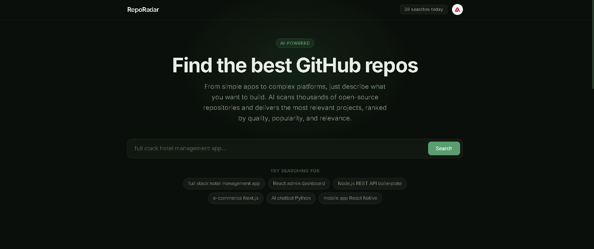
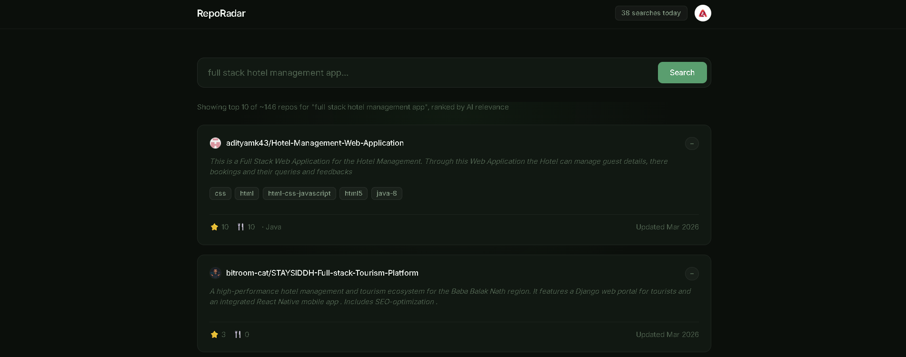
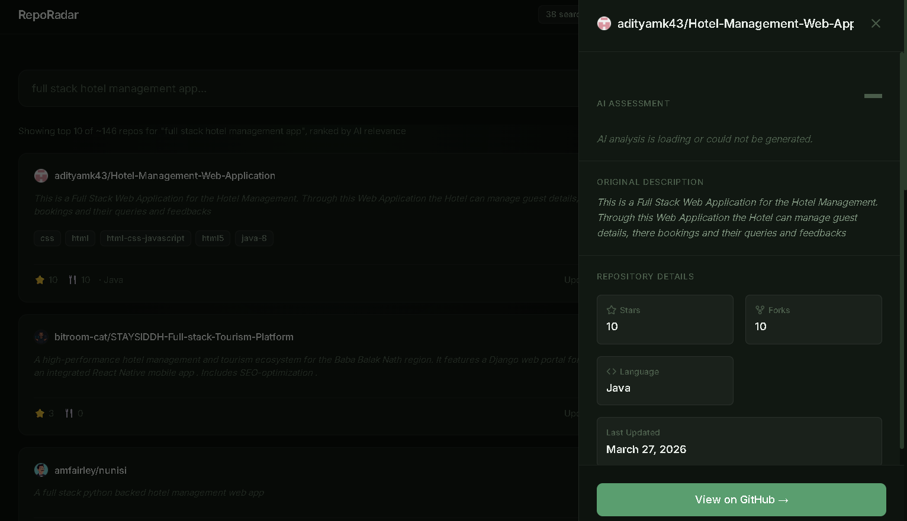

# RepoRadar

Find the best open-source GitHub repos for any project, ranked by AI.


> Type any project idea. Get the top GitHub repos scored and explained by AI.

## How it works

Users enter a natural language search query. The application fetches relevant repositories from the GitHub Search API. Groq AI evaluates the repositories, scores them, identifies their tech stack, and flags production-ready projects.

## Features

### Feature 1 — AI relevance scoring

Every result gets a 1–10 relevance score with a plain-English reason why it matches your query. This avoids simple keyword-based ranking.


### Feature 2 — Repo detail drawer

Clicking any card opens a slide-over panel. This displays the full AI summary, detected tech stack, production status, and a direct GitHub repository link.


### Feature 3 — Credit system with Clerk auth

Anonymous users get 5 free searches tracked in localStorage. A sign-in prompt appears after the 5th search. Signed-in users get 50 searches per day, reset automatically at midnight.

### Feature 4 — No backend required

All credentials and API keys remain in serverless Next.js API routes. The browser never accesses the GROQ_API_KEY or GITHUB_TOKEN directly.

## Tech stack

| Layer       | Technology                        |
|-------------|-----------------------------------|
| Framework   | Next.js 14 (App Router)           |
| Auth        | Clerk                             |
| AI          | Groq — llama-3.1-70b-versatile    |
| Search      | GitHub REST API v3                |
| Styling     | Tailwind CSS + shadcn/ui          |
| Deployment  | Vercel                            |

## Getting started

### Prerequisites

- Node.js 18+
- A Groq API key (free at console.groq.com)
- A Clerk account (free at clerk.com)
- A GitHub personal access token (optional but recommended)

### Setup

```bash
git clone https://github.com/yourusername/repofinder.git
cd repofinder
npm install
```

Create `.env.local`:

```env
NEXT_PUBLIC_CLERK_PUBLISHABLE_KEY=pk_test_...
CLERK_SECRET_KEY=sk_test_...
NEXT_PUBLIC_CLERK_SIGN_IN_URL=/sign-in
NEXT_PUBLIC_CLERK_SIGN_UP_URL=/sign-up
NEXT_PUBLIC_CLERK_AFTER_SIGN_IN_URL=/
NEXT_PUBLIC_CLERK_AFTER_SIGN_UP_URL=/
GROQ_API_KEY=gsk_...
GITHUB_TOKEN=ghp_...        # optional — raises rate limit to 30 req/min
```

```bash
npm run dev
```

Open http://localhost:3000

### Deploy to Vercel

```bash
npm install -g vercel
vercel
```

Add all `.env.local` variables in the Vercel dashboard under Project → Settings → Environment Variables.

## Rate limits

| Source         | Limit                          | Fix                              |
|----------------|--------------------------------|----------------------------------|
| GitHub (unauth)| 10 requests/min               | Add GITHUB_TOKEN to .env.local   |
| GitHub (auth)  | 30 requests/min               | Already handled with token       |
| Groq           | Generous free tier             | No action needed                 |
| App (anon)     | 5 searches                    | Sign in for 50/day               |
| App (signed in)| 50 searches/day               | Resets automatically at midnight |

---
> Screenshots in docs/screenshots/ — add homepage.png, results.png,
> and drawer.png after first run. Size: 1280×800px recommended.
